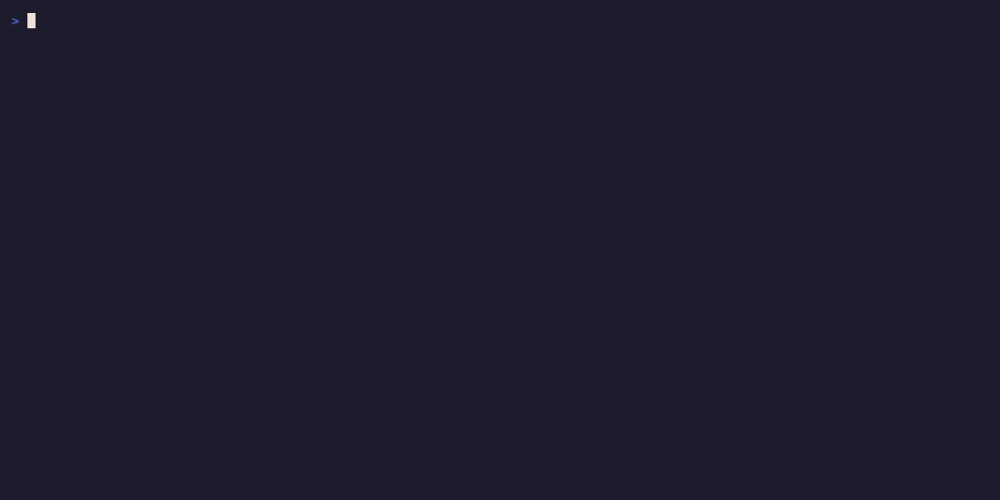
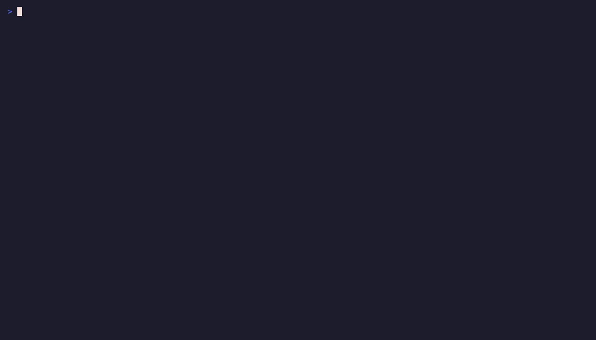
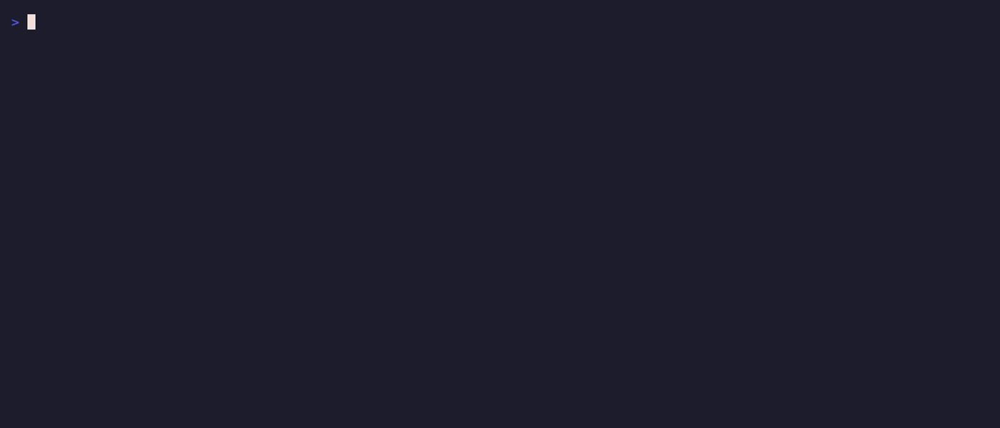
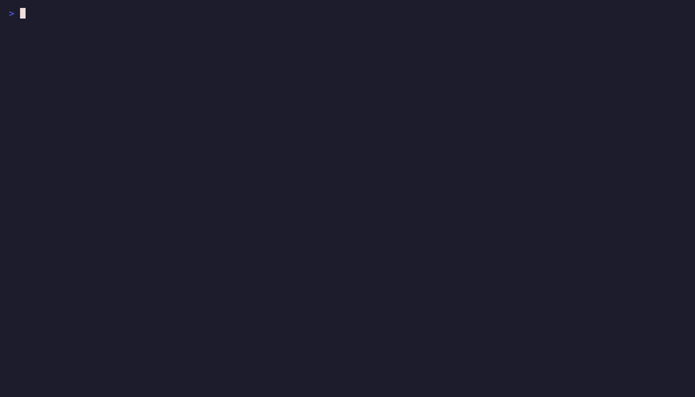

# rak

**rak** is `wc++` for LLM-first consumption. Walk a directory, count bytes/lines/words/chars/files, detect languages, split blank/comment/code, and emit compact TOON output by default — designed to be fed directly to a language model. From Swedish *räkna* ("to count").



## Install

```sh
go install github.com/evanmschultz/rak/cmd/rak@latest
```

After install, `rak` is on your `$GOBIN` (typically `~/go/bin/rak`).

Optional: shell completions via `rak completion <bash|zsh|fish|powershell>` (cobra default).

### From source

```sh
git clone https://github.com/evanmschultz/rak
cd rak
mage install   # builds and installs to $GOBIN
mage -l        # list all build/test/lint targets
```

## Quick examples

```text
$ rak --version
rak version v0.1.1

$ rak internal/counting
directories[1|]{path|files|bytes|lines|words|chars}:
  internal/counting|2|3495|138|523|3490
by_lang[1|]{dir|lang|blank|comment|code|bytes|lines}:
  internal/counting|go|13|25|100|3495|138
total_by_lang[1|]{lang|blank|comment|code|bytes|lines}:
  go|13|25|100|3495|138
total:
  bytes: 3495
  lines: 138
  words: 523
  chars: 3490
```

That's the default TOON output — compact, structured, designed for LLMs. Reading top to bottom: per-directory rollups (path / files / bytes / lines / words / chars), per-directory-per-language detail, per-language aggregates across the whole walk, grand total. The `total` block answers "how big is this repo?"; `total_by_lang` answers "how much Go vs Markdown is in it?"; `by_lang` breaks language detail down per directory; the `files` column on each directory row pairs with `--sort files` for "which dirs have the most stuff in them."

### Human-readable

```sh
rak --human internal/counting
```

Drops a TTY-styled view via `laslig`: per-directory blocks, embedded per-language sub-blocks, totals, and a `total lang:` summary at the bottom.



### JSON for pipes

```sh
rak --json . | jq '.total_by_lang.go.Lines.Code'
```

Structured output with `total_by_lang` mapped by language name. `omitempty` keeps undetected-language buckets out of the output.



### Common invocations

```sh
rak                          # count current dir (TOON, default)
rak ./internal               # count a specific path
rak --lang go,rust .         # only count Go and Rust files
rak --sort files .           # sort directories by file count (desc by default)
rak --sort path --sort-asc . # alphabetical directory order
rak --depth 2 .              # limit walk to 2 levels deep
rak --max-files 1000 .       # abort if more than 1000 files are accepted
rak --hidden .               # include hidden (dotfile/dotdir) entries
rak --include '*.go' .       # only files matching the glob
rak --exclude '*_test.go' .  # exclude files matching the glob
cat README.md | rak          # wc-parity counts on stdin
cat data.json | rak --json   # JSON output on stdin
```

**About `--sort`:** the value is a **key** — one of `lines`, `files`, `bytes`, `path` — not a path. Numeric keys (`lines`/`files`/`bytes`) sort descending by default; `path` sorts ascending. Pass `--sort-asc` to flip the default direction. The positional argument (e.g. `.` or `./internal`) is the walk root — separate from the sort key.



## Default behavior

- **Git-tracked by default.** When the walk root is inside a git repository, rak enumerates files via `git ls-files` — same set git itself considers tracked. Outside a git repo, rak falls back to a filesystem walker that respects `.gitignore`.
- **TOON output by default.** Compact, LLM-friendly format. `--human` for styled terminal output, `--json` for structured piping. `--toon` is an explicit alias for the default.
- **Hidden files skipped by default.** Pass `--hidden` to include dotfiles and dotdirs.
- **Binary files skipped by default.** Detected via NUL byte in the first 512 bytes. Pass `--binary` to include them.
- **Lockfiles counted.** `go.sum`, `package-lock.json`, etc. are tracked by git and counted in v0.1.0. v0.2 may add `--no-lockfiles`.

## Flags

| Flag | Default | Description |
|---|---|---|
| `--human` | off | render in human-readable (laslig) format |
| `--json` | off | render as JSON |
| `--toon` | off (implicit default) | render as TOON (LLM-first) |
| `--lang <list>` | none | filter to files whose detected language matches (e.g. `go,rust`) |
| `--sort <key>` | `lines` | sort directories by `lines`, `files`, `bytes`, or `path` |
| `--sort-asc` | off | flip sort direction from key-specific default (numeric keys default desc; `path` defaults asc) |
| `--max-files <int>` | `0` (no limit) | abort the walk when accepted file count exceeds N |
| `--depth <int>` | `0` (no limit) | max directory edges from the walk root |
| `--hidden` | off | include hidden files and directories |
| `--include <glob>` | none | only files matching the glob (repeatable, `**` supported) |
| `--exclude <glob>` | none | exclude files matching the glob (repeatable, wins over `--include`) |
| `--no-gitignore` | off | **inside a git repo: hard error** (rak uses git-tracked enumeration; this flag is meaningless). Outside a git repo: disable `.gitignore` filtering. |
| `--binary` | off | include binary files in counts |
| `--version` | — | print version and exit |
| `--help` | — | print help and exit |

Mutually exclusive: `--human`, `--json`, `--toon` (cobra rejects more than one).

## Languages detected

C, C++, CMakeLists.txt, CSS, Dockerfile, Go, HTML, Java, JavaScript, JSON, Kotlin, Makefile, Markdown, PHP, Python, Ruby, Rust, Shell (sh/bash/zsh/fish), Swift, TOML, TypeScript, YAML. Detection priority: special filename → extension → shebang → content heuristic. Files whose language can't be detected appear in counts but are excluded from `--lang` filtering and the `total_by_lang` block.

## Roadmap

rak v0.1.0 is deliberately small. Planned for v0.2:

- **Full polyglot language detection** — v0.1.0 covers 22 languages; v0.2 aims for full polyglot coverage.
- **Token counting** (`--tokens`, tiktoken).
- **Spinner / progress indication.**
- **Parallel walk.**
- **`--follow` symlinks.**
- **GoReleaser binary releases** (v0.1.0 ships via `go install` only).
- **`--include-untracked`** (opt-out from git-tracked-default).
- **`--no-lockfiles`** denylist flag.

## License

MIT. See [LICENSE](./LICENSE).
